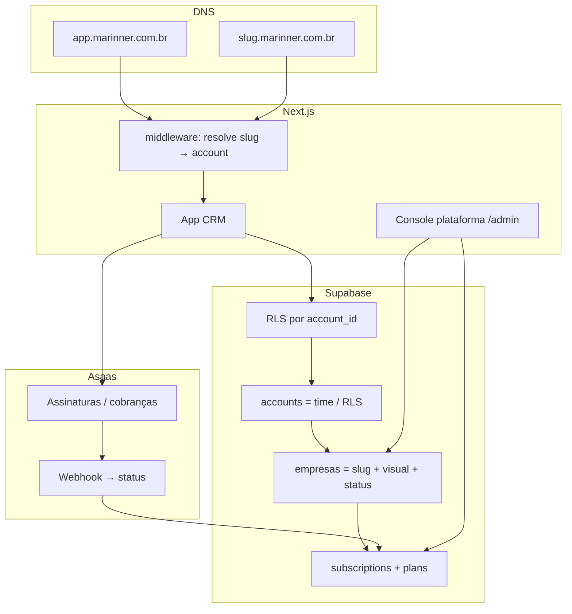
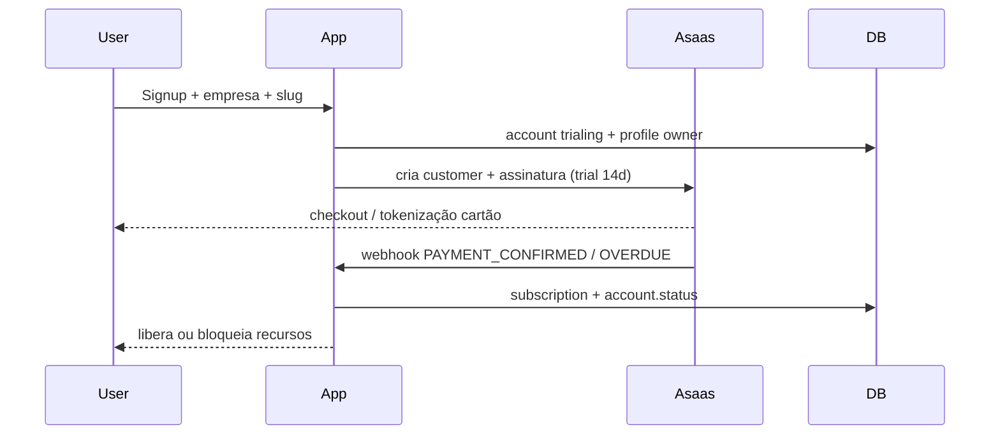

# Plano técnico — SaaS B2B Marinner

Decisões a partir de [`perguntas-saas-b2b.md`](./perguntas-saas-b2b.md).

## Decisões fechadas

| Tema | Escolha |
|------|---------|
| Modelo | **Self-serve hospedado** — cliente cria a empresa e vira `owner` |
| Acesso | App único + **subdomínio por empresa** (`minhaempresa.marinner.com.br`) |
| Cobrança | **Asaas** (PIX + boleto + cartão) desde o MVP |
| Marca | **Marinner** (default) + **white-label** (logo/cores por empresa) |
| Preço | **Plano flat por empresa** (com teto de seats por plano) |
| WhatsApp | **1 número por conta** (manter como hoje) |
| Trial | **Método de pagamento obrigatório no cadastro** + trial (padrão assumido: **14 dias**; ajustar se quiser outro) |

---

## Arquitetura-alvo (visão)

**Invariantes atuais que preservamos**
- Membership/RLS = `accounts` + `account_id` nas tabelas de domínio
- Roles `owner` / `admin` / `agent` / `viewer`
- 1 WhatsApp por account (`UNIQUE(whatsapp_config.account_id)`)

**O que muda**
- Tabela **`empresas`** (1:1 com account): slug, branding, status, trial, prefs
- Resolução por `Host` via `empresas.slug` (S12)
- Branding por empresa com fallback Marinner
- Planos + `subscriptions` por `empresa_id` + Asaas
- Cadastro self-serve com checkout Asaas + trial
- Console interno para suporte/plataforma

---

## Fase 0 — Fundação Marinner (branding de produto)

**Objetivo:** o produto deixa de se apresentar como “wacrm” na UI.

- Trocar títulos/metadata/toasts de marca para **Marinner** ([`src/app/layout.tsx`](../src/app/layout.tsx), `messages/pt-BR.json`, e-mails se houver)
- `NEXT_PUBLIC_APP_NAME=Marinner`, `DOMAIN_BASE=marinner.com.br` (e local `localhost`)
- Documentar URLs: apex `app.` vs tenants `slug.` → **[`docs/dominio-e-urls.md`](./dominio-e-urls.md)** (S02)
- Helpers: [`src/lib/domain.ts`](../src/lib/domain.ts), [`src/lib/brand.ts`](../src/lib/brand.ts)
- Manter package name interno `wacrm` se quiser (código); **usuário só vê Marinner**

**Done when:** login/dashboard/e-mails dizem Marinner; locale PT-BR já ok; env de domínio documentado.

---

## Fase 1 — Empresa comercial: `empresas`, planos e limites

**Objetivo:** cada **empresa** tem identidade SaaS (slug, visual, status) e um plano com limites, mesmo antes do Asaas estar 100% plugado.

**Spec:** [`docs/schema-empresas-s03.md`](./schema-empresas-s03.md)

### Schema (nova migration — S03)

| Tabela | Uso |
|--------|-----|
| **`empresas`** | 1:1 com `accounts`: slug, nome_fantasia, CNPJ, logo/cores, status, trial, locale, timezone, currency, settings |
| `plans` | Catálogo flat (Starter / Pro / Business) |
| `subscriptions` | Assinatura da **empresa** (`empresa_id`) + campos Asaas |

`accounts` permanece o hub de **time/membership/RLS**. Dados operacionais (contatos, inbox…) continuam com `account_id`.

### App

- Onboarding pós-signup: **nome fantasia + slug** → `empresas`
- Gate `getEntitlements` via empresa/subscription
- UI: banner trial / inadimplência lê `empresas.status`

**Done when:** signup cria account + empresa com slug; plano trial; convite respeita `max_seats`.

---

## Fase 2 — Asaas (cobrança self-serve)

**Objetivo:** cartão/PIX no cadastro; renovação e inadimplência automáticas.

### Fluxo

### Implementação

- Env: `ASAAS_API_KEY`, `ASAAS_WEBHOOK_TOKEN`, `ASAAS_ENV` (sandbox/prod)
- `src/lib/billing/asaas.ts` — customer, subscription, cancel
- `POST /api/billing/checkout` — inicia assinatura no plano escolhido
- `POST /api/webhooks/asaas` — valida token; mapeia eventos → `subscriptions` / `accounts.status`
- Settings → **Assinatura / Faturas** (owner): trocar plano, ver status, portal de pagamento Asaas se houver
- Soft-block em `past_due`: leitura ok; bloquear envio/broadcast/novos convites
- Hard-block em `canceled` / `suspended`: só Settings billing + suporte

**Done when:** sandbox Asaas completa trial → cobrança → `active`; falha de pagamento → `past_due` com gate.

---

## Fase 3 — Subdomínio por empresa

**Objetivo:** `minhaempresa.marinner.com.br` resolve a conta certa.

### Resolução

1. Middleware lê `Host`
2. Extrai subdomain vs `DOMAIN_BASE`
3. Busca `accounts` where `slug = subdomain` (cache curto, ex. 5 min)
4. Injeta `accountId` no contexto (header interno / cookie de tenant)
5. Apex `app.` / `www.` / `localhost`: fluxo marketing/login sem tenant; após login redireciona para `https://{slug}.{DOMAIN_BASE}/...`
6. Dev: `minhaempresa.localhost:3000` ou header `x-tenant-slug` / query `?tenant=`

### Segurança

- Toda query continua filtrada por `account_id` do membership **e** bate com o tenant do Host (anti cross-tenant)
- Cookies: `domain=.marinner.com.br` (como no padrão multi-tenant)
- Convites: links no host do slug da conta

**Done when:** dois slugs isolados no mesmo deploy; login no apex redireciona ao subdomínio correto.

---

## Fase 4 — White-label por empresa

**Objetivo:** Marinner default; cada conta pode personalizar aparência.

- Upload de logo (Storage bucket `account-branding`, path `{account_id}/…`)
- `primary_color` (e opcional `data-theme` por conta)
- Plugin/layout aplica CSS variables após resolver tenant
- Login no subdomínio já mostra logo da empresa
- Fallback: nome/logo Marinner

**Done when:** tenant A e B com logos diferentes no mesmo código.

---

## Fase 5 — Console de plataforma

**Objetivo:** você operar o SaaS (suporte, suspensão, planos manuais de emergência).

- Rota `/admin` (ou app separado) só para `platform_admins` (tabela ou allowlist de e-mails)
- Lista accounts: status, plano, slug, trial, Asaas ids
- Ações: suspender, estender trial, trocar plano, impersonate read-only (opcional, fase posterior)
- Logs de webhook Asaas para debug

**Done when:** dá para suspender uma conta inadimplente sem SQL manual.

---

## Fora do MVP (backlog explícito)

- Multi-número WhatsApp por conta
- Cobrança por uso/mensagem
- Multi-membership (usuário em várias empresas) — **avaliar na Fase 3**: com subdomínio self-serve, um usuário dono de 2 empresas pode precisar; se bloquear, owner cria só 1 account (regra atual)
- SCIM / SSO empresarial
- Nota fiscal automática (Asaas NF ou provedor)

> **Atenção produto:** hoje o schema é “1 user → 1 account”. Self-serve + várias empresas do mesmo dono exige ou (a) manter 1 account e usar só membros, ou (b) permitir multi-membership na Fase 3. **Recomendação:** na Fase 1 manter 1:1; na Fase 3, se um CNPJ tiver 2 slugs, implementar membership N:N ou “switch account”.

---

## Ordem de execução sugerida

| Ordem | Fase | Por quê |
|-------|------|---------|
| 1 | Fase 0 | Marca visível cedo |
| 2 | Fase 1 | Slug + planos + gates sem depender 100% do Asaas |
| 3 | Fase 2 | Asaas (você pediu gateway no MVP + cartão no cadastro) |
| 4 | Fase 3 | Subdomínios (você pediu `slug.marinner.com.br`) |
| 5 | Fase 4 | White-label |
| 6 | Fase 5 | Console admin |

Fases 3 e 4 podem sobrepor em parte (branding no tenant).

---

## Critérios de sucesso do MVP comercial

1. Empresa se cadastra, escolhe slug, informa pagamento (Asaas), entra em trial 14 dias  
2. Acessa `https://slug.marinner.com.br` com branding Marinner (e logo próprio se configurou)  
3. Plano flat aplica teto de seats  
4. Após trial, cobrança Asaas; atraso bloqueia envios  
5. 1 WhatsApp por empresa, como hoje  
6. Você suspende conta pelo console admin  

---

## Próximo passo

Confirmar:
1. **Dias de trial** (assumido 14)  
2. **Preços/nomes dos planos** (ou usar placeholders Starter/Pro/Business)  
3. Se **multi-empresa por usuário** entra no MVP ou fica no backlog  

Quando confirmar, implementamos começando pela **Fase 0 + Fase 1** (schema slug/status/plans + onboarding).
